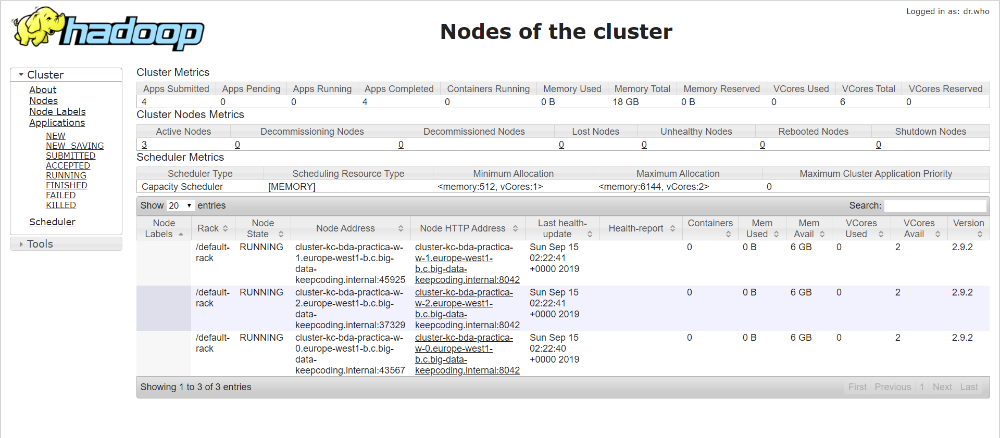

# Big Data Architecture - Práctica Airbnb
Este repositorio describe cada una de las partes desarrolladas en la práctica de Big Data Architecture del _Bootcamp Big Data & Machine Learning_ de [KeepCoding](https://keepcoding.io/es/)
## Estrategia
Desarrollar una herramienta que nos permita detectar carencias de servicios en determinadas zonas de las ciudades. Se trata de un sistema que nos pueda predecir oportunidades de negocio a partir de la recopilación y análisis de distintas fuentes de datos. A modo de ejemplo, podriamos predecir las necesidades de empresas de limpieza cercanas a pisos de alquiler.

## 1. Architectura y Flujo de datos
### Diseño
A continuación se muestra un diagrama con el flujo de datos y las tecnologías utilizadas para desarrollar el proyecto planteado:


Se pueden distinguir varios bloques:

#### Dadasets
Los datatasets utilizados. Nuestro sistema recopilará ademas del dataset de Airbnb otras fuentes de datos de distinta naturaleza como redes sociales, webs de anuncios, webs de venta de locales, tiempo,...

#### Procesado local (on-premise)
Dispondermos de varios web scrapers que se ejecutaran en local. Estos se programarán para que se ejecuten cada cierto tiempo dependiendo de la naturaleza de los datos (diariamente, semanalmente,...). Por ejemplo el módulo encargado de hacer scraping sobre las webs de anuncios podría ejecutarse una vez al día. Al mismo tiempo también dispondremos de otro módulo que será el encargado de subir los datos obtenidos al Cloud Storage de Google una vez se tenga la información recopilada en formato csv.

#### Procesao en la nube (GCP)
Para llevar a cabo los procesados sobre datos masivos de datos se ha optado por montar un cluster Hadoop en la plataforma de Google GCP. En este cluster se podrían llevar a cabo dos tipos de procesado: procesado en streaming y procesado en batch.

##### Procesado en streaming
Para la recopilar la información de las redes sociales se podría utilizar las APIs ofrecidas por estas redes y procesar la información mediante tecnologías como Apache Spark/Flink que nos permiten realizar análisis de sentimiento (en streaming). Apache Kafka se puede añadir como una capa que nos desacople la ingestión de los datos del procesado, de modo que al ser una tecnología de colas distribuidas y permanentes nos permita procesar la misma información por diferentes módulos o en instantes de tiempo distintos, en el caso de que sea necesario.

#### Capa de procesado en batch
Los distintos datasets recopilados por los scrapers junto con el dataset de Airbnb se subirán al Cloud Storage de Google, permitiendo mediante una tecnología como Hive cargar estos datos en tablas, y facilitar el cruce de la información, transformación de datos o agregaciones mediante queries SQL. Estos jobs también deberán automatizarse mediante algun programa que ejecute las consultas de ETL en Hive. En el ecosistema de Hadoop tenemos herramientas como Oozie que nos permite programar flujos de trabajo, pero también podrían ejecutarse de forma externa mediante un programa que ejecute las queries necesarias.

Una vez obtenida la información de sentimientos de las redes sociales y los distintos datasets tendremos nuestra "caja negra" de procesado donde se analizará toda esta información y se realizarán las predicciones correspondientes.

#### Visualización
Los resultados obtenidos se deberian publicar para que mediante una web o mediante herramientas de exploración y analisis de datos como Microsoft Power BI, Tableau o Superset se puedan consultar los datos de una forma amigable. Con estas herramientas los usuarios pueden conectarse a multitud de fuentes de datos y preparar cuadros de mando con los que poder interactuar.

Además de este tipo de visualización, para usuarios más avanzados también se tendría disponible los datos almacenados en el datalake, permitiendo su análisis ya consulta a través de notebooks como Jupyter.

## 2. Datasets y scraping
Ademas del datast de Airbnb, el proyecto hará uso de varias fuentes de datos con diferente formato, y que se extraerán mediante distintas técnicas. A modo de ejemplo se ha desarrollado un pequeño crawler utilizando la librería [scrapy](https://scrapy.org/). Esta crawler recoge la información de la web www.idealista.com. Puedes visualizar el código en la carpeta del repositorio code (_idealista-scraping.py_)

Otros posibles datasets que habría que evaluar serian:
- Twitter para análisis de sentimientos y su geolocalizacion, con la finalidad de evaluar las carencias de ciertos servicios en las ciudades.
- Distancias mediante la API de Google matrix.
- Predicciones de tiempo de AEMET.
- Datos estadísticos actuaciones Policía Municipal.
- ...

Tanto para el dataset de Airbnb como para el resto de datasets obtenidos faltaría una fase de limpieza y validación de los datos que actualmente no se ha realizado.

## 3. Despliegue de cluster Hadoop
### Crear bucket (Google Storage)
Google Cloud ofrece almacenamiento de objetos en la nube que se integra con la plataforma de Hadoop de Google Cloud, permitiendo ejecutar trabajos de MapReduce directamente en los datos de Cloud Storage o importar/exportar datos con HIVE.

Nos hemos creado un bucket adicional para identificarlo con un nombre que nos sea más fácil recordar. Además también se han creado varias carpetas dentro del bucket con las finalidad de tener una mejor organización de los datasets recogidos y enviados a nuestro datalake.

1. Creación del bucket con nombre __gs-kc_airbnb__


2. A continuación se muestra la organización


### Cluster en Google Cloud Platform
Los pasos a seguir son:
1. Ir a la consola de GCP
2. Seleccionar o crear un proyecto
3. Crear un cluster mediante el servicio Dataproc que nos permite crear de una forma sencilla clusteres con Apache Hadoop (HDFS, Pig, Hive,...) y Apache Spark.


4. En opciones avanzadas seleccionar el bucket que hemos creado.


5. Añadir las reglas en el firewall que nos dan acceso a las webs de administración de HDFS y YARN (en GCP funcionan a través de los puertos 8088 y 8970). También abrimos el puerto 10000 para las conexiones a Hive server.


6. Podemos ver las maquinas virtuales creadas. En nuestro caso hemos creado un cluster con un 1 master + 3 esclavos.


7. Una forma de comprobar que está todo funcionando y podemos acceder desde el exterior es acceder a la vista del Resource Manager para comprobar los recursos que gestiona YARN.



8. También podemos acceder a la vista de HDFS a través de la web.


## 4. Subir datasets al cluster
Para el procesamiento de los datos necesitamos subir alguno de los datasets que hemos extraído de forma local. Para ello haremos uso de Google Cloud Storage, ya que este almacenamiento se integra dentro de la plataforma Hadoop de Google Cloud, y podemos fácilmente consultarlo y cargarlos haciendo uso de HIVE.

### Subida de datos desde python
Para subir los datos extraídos mediante scraping o cualquier otro dataset adicional como un csv, json,... utilizaremos la API de python que google proporciona para comunicarse con Google Cloud Storage. A diferencia de las pruebas que hemos hecho desde un Colaboratory, cuando lo utilizamos desde un cliente local necesitaremos autentificarnos para poder llevar a cabo la subida de los ficheros. A modo de ejemplo se ha implementado un pequeño programa en python que sube tanto el dataset de Airbnb y el scrapeado de la web www.idealista.com. Puedes consultar el programa en al carpeta code de este repositorio (_gs-uploader.py_)

Para poder autentificarnos los pasos a seguir son:
1. Crear un cuenta de servicio
2. Rellenar los campos que nos pide y seleccionar crear clave de tipo json.


3. Se descagará un fichero json con nuestra clave privada y que utilizaremos desde python para autentificarnos.

4. Nuestro programa necesitará las librerias cliente para conectarse al Cloud Storage

```
pip install --upgrade google-cloud-storage
```

## 5. Ingestion y Procesado de datos
### HIVE
Para mostrar cómo podría ser la carga de los datos en Hive, se han creado las tablas que almancenarían los dataset de Airbnb y el extraído a partir del web-scraping de [idelista.com](https://www.idealista.com)

```sql
CREATE TABLE airbnb (ID INT, Listing_Url STRING, Scrape_ID STRING, Last_Scraped STRING, Name STRING, Summary STRING, Space STRING, Description STRING, Experiences_Offered STRING, Neighborhood_Overview STRING, Notes STRING, Transit STRING, Access STRING, Interaction STRING, House_Rules STRING, Thumbnail_Url STRING, Medium_Url STRING, Picture_Url STRING, XL_Picture_Url STRING, Host_ID STRING, Host_URL STRING, Host_Name STRING, Host_Since STRING, Host_Location STRING, Host_About STRING, Host_Response_Time STRING, Host_Response_Rate STRING, Host_Acceptance_Rate STRING, Host_Thumbnail_Url STRING, Host_Picture_Url STRING, Host_Neighbourhood STRING, Host_Listings_Count STRING, Host_Total_Listings_Count STRING, Host_Verifications STRING, Street STRING, Neighbourhood STRING, Neighbourhood_Cleansed STRING, Neighbourhood_Group_Cleansed STRING, City STRING, State STRING, Zipcode STRING, Market STRING, Smart_Location STRING, Country_Code STRING, Country STRING, Latitude STRING, Longitude STRING, Property_Type STRING, Room_Type STRING, Accommodates STRING, Bathrooms STRING, Bedrooms STRING, Beds STRING, Bed_Type STRING, Amenities STRING, Square_Feet STRING, Price STRING, Weekly_Price STRING, Monthly_Price STRING, Security_Deposit STRING, Cleaning_Fee STRING, Guests_Included STRING, Extra_People STRING, Minimum_Nights STRING, Maximum_Nights STRING, Calendar_Updated STRING, Has_Availability STRING, Availability_30 STRING, Availability_60 STRING, Availability_90 STRING, Availability_365 STRING, Calendar_last_Scraped STRING, Number_of_Reviews STRING, First_Review STRING, Last_Review STRING, Review_Scores_Rating STRING, Review_Scores_Accuracy STRING, Review_Scores_Cleanliness STRING, Review_Scores_Checkin STRING, Review_Scores_Communication STRING, Review_Scores_Location STRING, Review_Scores_Value STRING, License STRING, Jurisdiction_Names STRING, Cancellation_Policy STRING, Calculated_host_listings_count STRING, Reviews_per_Month STRING, Geolocation STRING, Features STRING) ROW FORMAT DELIMITED FIELDS TERMINATED BY ';';
```

Como tenemos los datos en el Cloud Storage podemos cargar directamente los datos indicando el path a gs (Cloud Storage):
```
LOAD DATA INPATH 'gs://gs-kc-airbnb/datasets/airbnb/airbnb-listings-lite.csv' INTO TABLE airbnb;
```
Para la carga del dataset de prueba que hemos scrapeado de la web [idelista.com](https://www.idealista.com)

```
CREATE TABLE locales (Title STRING, Price STRING, m2 INT, Telf STRING, Desc STRING) ROW FORMAT DELIMITED FIELDS TERMINATED BY ';';
```

```
LOAD DATA INPATH 'gs://gs-kc-airbnb/datasets/idealista/idealista-locales_20190912.csv' INTO TABLE locales;
```

> Nota: Esto es un pequeño ejemplo, pero estos datos necesitarían una limpieza y transformación de algunas columnas. Por ejemplo tenemos números con el formato español y convendria pasarlo a formato americano (decimales con .)

Para ejecutar estas queries de carga se ha utilizado la herramienta [DBeaver](https://dbeaver.io/) que permite ejecutar y visualizar facilmente queries SQL sobre multitud de bases de datos.

A continuación se muestran algunas imagenes:

- Configuración de la conexión


- Carga de los datos mediante DBeaver


### Procesado de los datos
Como ejemplo de lo que podría ser lanzar una tarea de procesado se ha utilizado el programa **wordcount**.
De forma manual nos conectamos mediante SSH a una de las máquinas del cluster para lanzar la tarea MapReduce:

```bash
yarn jar hadoop-mapreduce-examples.jar wordcount 'gs://gs-kc-airbnb/datasets/airbnb/airbnb-listings-lite.csv' 'wordcount'
```


También se podría realizar mediante la utilidad de lanzar tareas del GCP Dataproc.

